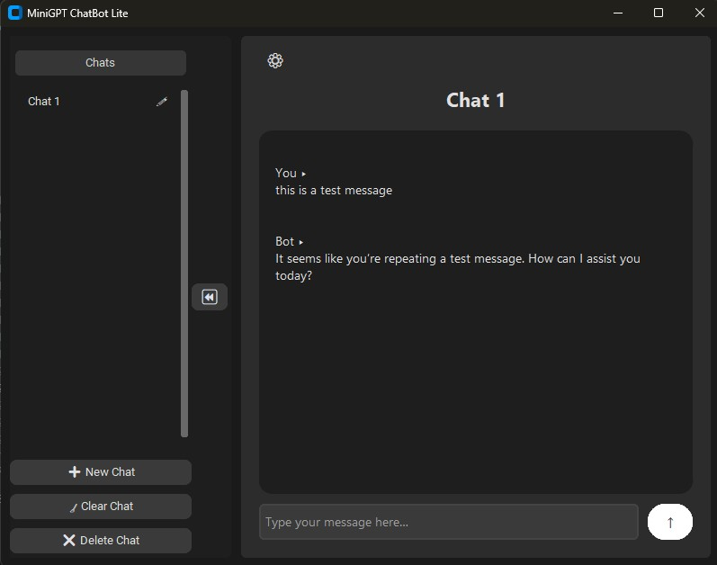

# 🧠 GPT Lite for Windows

A beautifully designed, lightweight desktop chatbot powered by OpenAI’s GPT API. Built with ❤️ in Python using the `CustomTkinter` GUI framework. GPT Lite is perfect for users who want a minimal, fast, and local chat experience with modern UI and offline chat storage.

---

## ✨ Features

- 💬 **Clean Chat Interface** with chat history and session switching
- 🌓 **Dark / Light Mode** toggle with smooth theme switching
- 💾 **Local Chat Saving** using `zlib` + `pickle` (compact & fast)
- 📝 **Inline Renaming of Chats** like ChatGPT
- 🔄 **Sidebar Toggle**, multiple sessions
- 🎉 **Welcome Screen** with typing animation
- ⚙️ **Settings Panel** with theme customization
  

---

## 📸 Screenshot


---

## 🚀 TO DO- 

- 📂 **Data saved in `%APPDATA%\GPTLite`**
- 🔐 **Secure API Key Input** (stored in local AppData)
- ⚙️ **Compiling/building of the executable and release**
---

## 🚀 Installation

1. **Clone the Repository**

   ```bash
   git clone https://github.com/Blitzdevdaddy/gpt-lite
   cd gpt-lite
